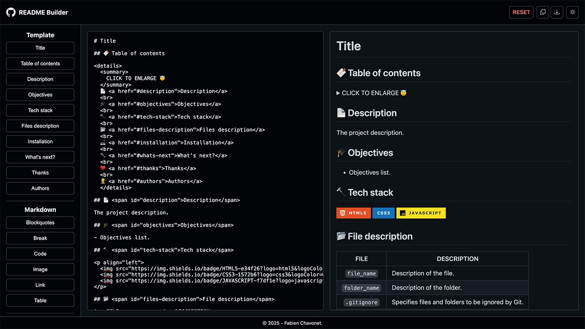
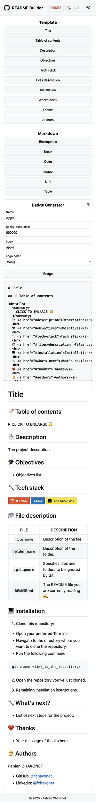

# GitHub README Builder

## Description

GitHub README Builder is an interactive web application that lets users compose, preview, and export professional README.md files for GitHub repositories.

It features a live Markdown editor, predefined content blocks, custom badge generation, and a real-time preview styled with GitHub-like formatting.

## Objectives

- Provide a user-friendly Markdown editor focused on GitHub READMEs.
- Enable quick insertion of structured sections (titles, objectives, tech stack...).
- Render live previews with GitHub-like styling.
- Offer badge generation using [Shields.io](https://shields.io/) and [Simple Icons](https://simpleicons.org/).
- Improve DOM manipulation and UI/UX handling using vanilla JavaScript.

## Tech Stack


## File Description

| **FILE**     | **DESCRIPTION**                                     |
| :----------: | --------------------------------------------------- |
| `assets`     | Contains the resources required for the repository. |
| `index.html` | Main HTML structure for the project.                |
| `style.css`  | Styles and animations for the project.              |
| `script.js`  | Behavior script for interactivity.                  |
| `README.md`  | The README file you are currently reading 😉.       |

## Installation & Usage

### Installation

1. Clone this repository:
    - Open your preferred Terminal.
    - Navigate to the directory where you want to clone the repository.
    - Run the following command:

```
git clone https://github.com/fchavonet/full_stack-github_readme_builder.git
```

2. Open the cloned repository.

### Usage

1. Open the `index.html` file in your web browser.

2. Start writing your Markdown content in the editor area.

3. Use the sidebar buttons to insert predefined modules (title, objectives, badge...).

4. Click the copy or download button to save your README file.

You can also test the project online by clicking [here](https://fchavonet.github.io/full_stack-github_readme_builder/).

<table>
    <tr>
        <th align="center" style="text-align: center;">Desktop view</th>
        <th align="center" style="text-align: center;">Mobile view</th>
    </tr>
    <tr valign="top">
        <td align="center">
            <picture>
                <source media="(prefers-color-scheme: dark)" srcset="./assets/images/screenshots/desktop_page_screenshot-dark.webp">
                <source media="(prefers-color-scheme: light)" srcset="./assets/images/screenshots/desktop_page_screenshot-light.webp">
                
            </picture>
        </td>
        <td align="center">
            <picture>
                <source media="(prefers-color-scheme: dark)" srcset="./assets/images/screenshots/mobile_page_screenshot-dark.webp">
                <source media="(prefers-color-scheme: light)" srcset="./assets/images/screenshots/mobile_page_screenshot-light.webp">
                
            </picture>
        </td>
    </tr>
</table>

## What's Next?

- Add local storage support to preserve user settings and drafts.
- Improve mobile responsiveness and usability.

## Thanks

- Thanks to [Shields.io](https://shields.io/) and [Simple Icons](https://simpleicons.org/) for the badge generator compatibility.

## Author(s)

**Fabien CHAVONET**
- GitHub: [@fchavonet](https://github.com/fchavonet)
